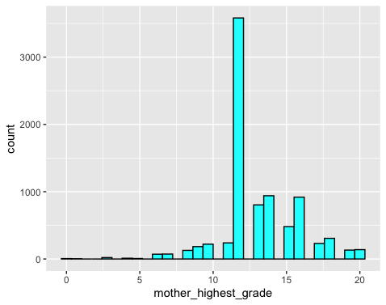
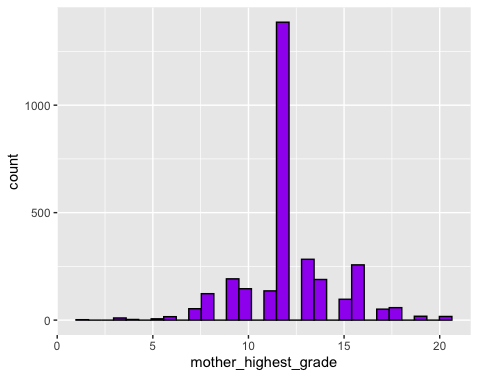

```{r setup, include=FALSE}
knitr::opts_chunk$set(echo = TRUE)
```


## Introduction
\doublespacing
  The decision to enroll in college or not consists of many factors. Career plans to affordability, and maturity and readiness for college are just a few of the factors teens discuss when choosing to enroll in college or not. But the decision may be so much more than that. People that have already been to college or who plan to go to college, or even whose parents went to college are aware of some of the basic steps that they must take to be prepared: taking/studying for the SATs and ACTs, taking/studying for the PSAT/NMSQT, taking honors and AP classes, doing dual enrollment or taking classes at the local community college to gain college credits, etc. Even how to apply for scholarships and financial aid, when and how to fill out the FAFSA, and more is knowledge more readily accessible to someone who has already been through the college process. Therefore, I want to test the effect that parental education has on a child's decision to enroll in college or not.

## Literature Review

  The idea that children make decisions based on what their parents do/did is hardly novel. Several papers examine the relationship between parental education level and its effect on a child's decision to enroll in college. Those presented here are merely a brief overview of the total literature.
  
  In their article *Direct and Indirect Effects of Parental Education Level on the Demand for Higher Education*, authors David A. Kodde and Jozef M. M. Ritzen find that the effect of parental education level is only indirect on a child's schooling decision. It is worth noting that the author's data comes from the Netherlands. The Dutch system is far more structured, not just anyone can choose college, and there is little to no direct cost to college. All of these are very different from the US, so it is unclear how these results will then translate to the US. Here, your ability to navigate the college search process seems to heavily relate to the experience your parents have with it. The authors hypothesize that the actual driving force of this result is the family's income: parents with higher education levels have more money, and it's actually the money that affects a child's decision to go to college [@kodde88].
  
  It is worth noting that, while neither is statistically significant, Kode and Ritzen (1988) observe that the education level of the mother has a larger effect than that of the father. This is in keeping with the results of Diganta Mukherjee and Saswati Das in their article *Role of Parental Education in Schooling and Child Labour Decision: Urban India in the Last Decade*. The authors study what factors affect whether or not a child drops out of school to join the labor force. They find several factors that play a significant role, especially parental education. Not only this, but they find that mother's education is particularly important. The role of women empowerment in developing countries is its own topic, but the results by Mukherjee and Das support that of Koda and Ritzen [@muk_08]. Given that the dataset I compiled only had observations for maternal education level, this gives some peace of mind for my own model.
  
  In contrast to Kodde and Ritzen, Folorunso, Aremo, and Abogan in their article *Family Characteristics, Students' Reading Habits, Environment and Students' Academic Performance in Nigeria* also find that parental education level and income were strong predictors of academic achievement for students in Nigeria [@folor_10]. Given that both Mukherjee and Das and Ritzen et al. are studies on developing countries, it is worth considering whether parental education simply matters more in countries like India and Nigeria than in developed countries like the Netherlands or the U.S. But it is also possible, as mentioned previously, that the difference between the Dutch/European system and the United States means that the Kodde and Ritzen paper is not suitable to be applied to the U.S. population. 
  
  With the necessity of studying the U.S. in mind, we can turn to the paper *Skill, Parental Income, and IV Estimation of the Returns to Schooling* by Robert Lemke and Isaac Rischall. The authors use data from the NLSY79 to study parental education's effects on the returns to schooling. While returns to schooling is slightly different than education level, it is still worthwhile to examine the results, especially given that they use almost the same data as I do. However, as described in the Future Data Improvements of the data section, the authors have nicer data by taking advantage of pre-existing variables that record parental education level. What Lemke and Rischall find is that parental education level is a better predictor of returns to education than institutional variables. This could be due to some inherent quality that is present in the family, but we cannot be entirely sure. 
  
  To try and gain some understanding of the reason why parental education is such a strong influence, Christopher Spera, Kathryn R. Wentzel, and Holly C. Matto in their article *Parental Aspirations for Their Children’s Educational Attainment: Relations to Ethnicity, Parental Education, Children’s Academic Performance, and Parental Perceptions of School Climate* find that parental education and child’s education levels are significantly related to parental aspirations for the children. This offers a possible explanation for the relationship that I find, discussed in the results section [@spera_08].
  
  While the education literature is vast, one thing we can conclude from this brief literature review is that there is no definite answer on whether or not the parental education level has a significant effect on a child's own education level or, more to the point of this paper, the decision to enroll in college or not. It seems like it does, but there is some contradicting literature. Furthermore, even if we can prove a causal relationship, or at least a strong correlation, we are still left with trying to explain the *why* of that relationship.

## Data

  The data that I use comes from the National Longitudinal Survey of Youth 1979 Cohort and the children of the  NLSY79 cohort.
  
### Data Cleaning Procedure
  Due to the nature of the NLSY, there were many steps I had to take to get the data in a workable state for running a regression. I use the BLS website and the NLSY79 finder to get the variables I wanted to use/build on in my model. Due to the nature of the project, I was interested in a very basic econometric model, described in the empirical methods section and outlined below:
  
  1. Whether or not the child enrolled in college
  2. The education level of the mother
  3. Family income
  4. Race
  
  Because it's the NLSY79, the data required a lot of cleaning. While most of it involved basic filtering and mutating for legibility, I also had to create two of my variables. The NLSY79 child/young adult survey has several holes in it, a big one being that there is no single variable that records the highest degree/years of schooling achieved by the students. I initially wanted to study more than the decision to enroll or not, but was limited by what is in the dataset. By looping through the observations for the several columns that record the level of education, I created a binary "enrolled in college vs. did not enroll in college" variable. The biggest issue I had with this variable is that it had several thousand observations missing, as described below in the potential issues section. 
  
  The other variable I had to create is family income. This required finding the family income recorded for the mother in every year and matching it to the year the child was born to record the family income for each year of the child's life until 18, when they would decide to enroll in college or not. Again, there was a *lot* of missing information. I took an average over all 18 years using an na.omit() command. This is also not without issues, as discussed below. Naturally, for the regression, I took a logarithm of this variable for more statistically sound results.
  
### Potential Issues with the Data

  The biggest concern with the data cleaning is how many people I had to exclude because there was never *any* recorded information about their education level. The original NLSY79 child/young adult data set has 11,545 observations. Of those, 3,046 never recorded any information about their education level. I chose to handle this through simply dropping these observations from the model, because each method of handling missing data has flaws. The problem with this approach, is that there may be fundamental differences between the groups of people. Before I did any data analysis, I split my data into two sub-data sets, one for the people whom we have education data for, and one for whom we don't. The table of showing a summary of these for the variables included in the regression can be found in the "Tables" section of the paper.
  
  Looking at the tables, there are a couple areas of concern. Most notably, the average family income prior to enrolling in college is approximately \$6,000 higher for students that we do have education data on. The mother's average education level is also higher. This is again a bad sign, given that we are testing the decision to enroll in college or not. In the data, the number stands for number of years of education. Therefore, seeing that the average is above 13 for the children for whom we do have education data, this implies that their mothers are more likely to have gone to college themselves. This is an important warning and context in which to interpret our results. Our sample seems to have higher income and mother's education levels. Figures 1 and 2 show the difference in mother's highest grade in a histogram.
  
### Future Data Improvements

  In an ideal world, I would be able to solve all the problems with the data. I would like to fix the following:
  
  1. Get data on the years of education of the child, i.e., I would like more than just the decision to enroll or not. My original plan when I set about writing this paper was to have the decision to enroll vs. not and then completion vs. not. My hypothesis was that we would see a stronger effect on the completion of college for students whose parents had completed college. The reasoning was that a parent who has completed college is going to be more capable of coaching their child through when college gets tough: failed classes, financial difficulties, general mental health struggles, etc. Unfortunately, due to the nature of trying to conduct a longitudinal survey of thousands of youths and being one of the only publicly available data sets gathering a broad array of information on so many people, there is just a lot of missing information and inconsistent coding in the NLSY79. This is only worse in the children and young adults of the NLSY79, likely because they weren't even the original group being surveyed. As explained above, I had to use the highest-grade-ever-completed variables and was left with a large gap in information. I would love to have more complete information to study the enrollment vs. graduation decision. 
  2. Get data on both parents education levels. Due to the nature of the NLSY79 and child/Young Adult, I only had data on the mothers. The analysis would be more complete with father's data. That would also allow me to look at the effect of a mother's vs. father's education level, which could lead to interesting results. There would be generally much more that I could do about the effects of gender if I had father's education level (mother vs. father for boys vs. girls, etc.). As is always true, a more complete data set would be ideal.
  3. Intelligence/ability measure. After spending a long time looking, there simply isn't a meaningful measure of intelligence for the children/young adults. The intelligence measures can be found [here](https://www.nlsinfo.org/content/cohorts/nlsy79-children/topical-guide/education/aptitude-achievement-intelligence-scores). A possible fix would be to  use the AFQT scores of the mothers as a proxy variable, but this would also be flawed. However, it is supported by the results in Lemke and Rischall's paper, discussed in the literature review section [@lemke_03]. The best solution to this problem would be to use another dataset. I can only hope that, if they choose to do a child's survey of the 1997 cohort, the BLS gets better intelligence test scores. Ideally, for studying anything related to college, an ACT/SAT score should be recorded.
  
  The easiest solution to all these problems would be using data from the NLSY97 cohort. In my own eagerness to use the same data for this paper as my thesis, I neglected to discover that I could have saved myself several hours of work. The NLSY79 and NLSY97 cohorts both have variables recording the parental education level. This was not something I realized until I was reading the Lemke and Rischall paper (2003). It has data for both the parents, it has intelligence scores, and it has more complete years of education results. This would have been an easier and better solution to the above problems. However, given the experience gained from doing a manual data cleaning, using the NLSY79 and their children was still a worthy task.

## Empirical Methods

  Since I am using a binary dependent variable, there are two options for my model: Linear Probability Model and logistic regression. Each has merits, so I have chosen to do both and compare them.
  
### The Mathematical Model

  My basic model equation is the following: 
  
  $$\text{YA.Enroll} = \beta_0 + \beta_1 \ \text{Mother.Ed.Level} + \beta_2 \ \text{YA.Race} + \beta_3 \ \text{Family.Income} + \varepsilon$$

  
  How exactly this should be interpreted depends heavily on which model we are using, so more details on interpretation follow in the appropriate subsections. I decided on this model for a few reasons. The mother's education level is our variable of interest, while race and income provide our controls. There are probably a few other controls that would be interesting to use, such as geographic location, but this provides a good jumping off point for an exploratory model. Given the time constraints of the semester, a fully developed model would be impossible, but this is enough to provide preliminary results about the issue.
  
### Linear Probability Model

#### Interpretation
  In a linear probability model, interpretation is quite simple. We can look at our output and see our betas directly as changes in the probability of the child to enroll in college. Despite the delight of a clear interpretation, there are some major issues with using a linear probability model.

#### Problems
  The biggest issue with the linear probability model is that it violates our assumption of a normal distribution of errors. This is a fundamental assumption to regression; however, in the linear probability model, since our outcome can only be 0 or 1, our error term is either 0 or 1. This is a clear violation of the regression assumptions.
  
  The error terms of the linear probability model also violate the assumption of homoskedasticity. The error terms depend on the value of our X, violating our assumption. This is a problem because it is that assumption that allows us to conclude that our OLS estimators are BLUE - Best Linear Unbiased Estimators. We can use robust standard errors to combat this problem, but we need to be aware of it when choosing the best possible model.
  
  The final major issue with the linear probability model is that, for predictions, we may end up with a value greater than one or less than zero. Because we are dealing with probabilities, these are nonsensical values. The linear probability model is still a useful tool, especially because it is so easy to interpret, but we cannot ignore all the potential issues with it.
  
### Logistic Regression

  Logistic regression solves/improves the problems mentioned above by applying the logistic function $\frac{1}{1 + e^{-(\beta_0 + \beta_1x)}}$ to our model. this restricts our predicted values to (0,1), which was a problem with the linear probability model, and we also fix the other problem. For this reason, the logit model is often preferred to a linear probability model. I could also use a probit model, but, as logit vs probit is generally considered a matter of personal taste and the results are often similar to the logit results, I have chosen to use the logit model.

## Research Findings

  The findings for each of my models is discussed below in the appropriate sections.

### Linear Probability Model

  The regression results can be found in table 2 in the Tables and Figures section. Note that the mother's years of education is a factor variable, which is why it is evaluated at all 20 different levels. The value of zero means that the mother didn't have any education (applies to 5 or fewer mothers), and every other year corresponds to that may years of education. For example, 13 means one year of college and 17 means 5 years of college/post-high school education. Because of this, I made year 12 (graduating high school) my base level for the  factor variables. This means that the coefficients are interpreted in relation to having graduated high school. While it mathematically doesn't make a very big difference which variable we use, this made the most sense for the logic and story of the model. This applies to the logistic regression as well.
  
  Because we are running a linear probability model, the coefficients can be interpreted as increases in the probability that the child enrolls in college. The results on education are exactly what we expect: starting in the sixth grade (middle school/junior high, another big transition/life phase point), every year has a negative effect on the probability that a child goes to college relative to a high school graduate. What is a little surprising is that we might expect the coefficient size to get smaller and smaller with each year of education (each additional year would be expected to have a positive effect on education), but this is not the case. However, except for "grade 17" (fifth year of college), we do see this positive effect on each additional year of education. That is, for each additional year that the mother is educated, her child is statistically significantly more likely to enroll in college than the year before. 
  
  Unusually, we do see statistical significance on the zero education variable using robust standard errors at the $\alpha = 0.05$ level. However, given how few observations fall into this category, it isn't particularly economically significant.
  
  Another unexpected result is on the race variable. This is also a factor variable, and the base level is 1 (Hispanic), with 2 being Black and 3 being non-Black, non-Hispanic (probably mostly composed of Asian and white). We see that, relative to people who are Hispanic, being non-Black and non-Hispanic makes a student statistically significantly more likely to enroll in college. Being Black is statistically significant for both the robust and non-robust standard errors at the $\alpha = 0.05$ significant level. This could possibly be explained by something like immigration status, which would be worth including in a follow-up paper.
  
  What is surprising is that the logarithm of family income has a statistically significant negative effect on a child's decision to enroll in college. This is quite possibly the result of all the missing data. This is such a baffling result that I cannot think of any other explanation.
  
  One final thing to take note of is the very low $R^2$ of the model. This means that it's explanatory power is very low. This is hardly surprising in an exploratory model. What is surprising is that, similarly to how log of family income was not significant, family income is considered a powerful explanatory variable for college decisions. Again, due to the issues in the data discussed previously, it is worth considering whether this is a new and novel result or merely a problem with the data.
  
  I also ran my model with categories for the education levels: 1 = elementary school (0-5), 2 = middle school (6-8), 3 = high school graduate (9-12), 4 = college (>12). Results are in Table 4. This model tells essentially the same story, but it's worth noting that the adjusted $R^2$ is lower for this model. This suggests that, while the categorical bins are the more standard procedure for this type of analysis, the reduce the explanatory power of the model to such an extent that even having the 20 regressors is better for explanatory power. However, given the overall low $R^2$ of both models, I am not too concerned about this.

### Logistic Regression

  The results of the regression can be found in Table 5. While this model is statistically more valid than the linear probability model, the results are overall very similar. An unfortunate part of doing a logit (or probit) model is that the coefficients are not as easily interpreted. Instead of having a probability, we have the log of the probability.
  
  The general trends in the results for mother's education level observed above still hold true. However, we do not see significance on the zero-education variable. We do see the same odd effect on year 17 of education: while it is still a positive effect relative to a high school education, it breaks the trend of stronger and stronger effects for each additional year of education. There's no clear explanation for why this would be true from the codebook for the variable, but is very interesting. The best possible explanation may be that year 17 is capturing students who took five years to complete their undergraduate degrees while years 18 and up are capturing master's and doctoral/professional degrees. But this is not clear from the codebook, so it is just a possible guess.
  
  We again see a statistically significant positive effect on log probability of being non-Black and non-Hispanic and being Black relative to being Hispanic. 
  
  I ran this model with the bins as well, and it again did not change anything about the statistical significance of the results. It does make it more in-keeping with standard practice. The results are in Table 6.

## Conclusion

  In the literature, the effects of parental education on a child's education is slightly mixed. Some find it to not have an effect, others find it to be highly significant. Using data form the NLSY79 cohort and their children, we do see a statistically significant effect on a child's college enrollment decision. This is consistently true in both a linear probability model and logistic regression. We also interestingly observe a negative effect of income on the decision to enroll in college for the logit model and no statistically significant effect in the linear probability model. This may be due to the large amounts of missing data, discussed in the data section.
  
  There are many improvements that could be made to this paper. Most significantly, using better data as described in the data section may lead to starkly different results. However, this provides a helpful jumping off point and an excellent example of some of the pitfalls of missing data.

## Tables and Figures

### Table 1: Variable Distribution for Children with No Recorded Education

|vars |n       |mean      |sd        |min     |max        |range      |se      |
|:--------------|:-------|:---------|:---------|:-------|:----------|:----------|:-------|
|Child's ID |3046.00 |767567.35 |341101.33 |202.00  |1267501.00 |1267299.00 |6180.43 |
|Mother's ID |3046.00 |7675.66   |3411.01   |2.00    |12675.00   |12673.00   |61.80   |
|Child's Race |3046.00 |2.64      |0.68      |1.00    |3.00       |2.00       |0.01    |
|Child's Sex |3044.00 |1.49      |0.50      |1.00    |2.00       |1.00       |0.01    |
|Child's Birth Year |3046.00 |1984.44   |6.22      |1971.00 |2014.00    |43.00      |0.11    |
|Average Family Income |2979.00 |55329.49  |55803.89  |3006.44 |503912.57  |500906.13  |1022.42 |
|Mother's Highest Grade |3043.00 |12.27     |2.50      |1.00    |20.00      |19.00      |0.05    |

### Table 2: Variable Distribution for Children with Recorded Education
|vars |n       |mean      |sd        |min     |max        |range      |se      |
|:--------------|:-------|:---------|:---------|:-------|:----------|:----------|:-------|
|Child's ID |8499.00 |540784.50 |326458.68 |201.00  |1266703.00 |1266502.00 |3541.15 |
|Mother's ID |8499.00 |5407.82   |3264.59   |2.00    |12667.00   |12665.00   |35.41   |
|Child's Race |8499.00 |2.23      |0.79      |1.00    |3.00       |2.00       |0.01    |
|Child's Sex |8499.00 |1.49      |0.50      |1.00    |2.00       |1.00       |0.01    |
|Child's Birth Year |8499.00 |1986.69   |6.39      |1970.00 |2006.00    |36.00      |0.07    |
|Enrollment Decision |8499.00 |0.59      |0.49      |0.00    |1.00       |1.00       |0.01    |
|Average Family Income |8339.00 |61764.51  |57915.10  |0.00    |471103.00  |471103.00  |634.21  |
|Mother's Highest Grade |8499.00 |13.16     |2.60      |0.00    |20.00      |20.00      |0.03    |

### Table 3: Linear Probability Model Results

|                       | Non-Robust Standard Errors | Robust Standard Errors |
|:----------------------|:--------------------------:|:----------------------:|
|(Intercept)            |          0.702***          |        0.702***        |
|                       |          (0.067)           |        (0.067)         |
|mother_highest_grade0  |          -0.341+           |        -0.341*         |
|                       |          (0.192)           |        (0.153)         |
|mother_highest_grade1  |           -0.032           |         -0.032         |
|                       |          (0.234)           |        (0.255)         |
|mother_highest_grade3  |           0.189+           |         0.189+         |
|                       |          (0.103)           |        (0.100)         |
|mother_highest_grade4  |           -0.162           |         -0.162         |
|                       |          (0.142)           |        (0.146)         |
|mother_highest_grade5  |           -0.104           |         -0.104         |
|                       |          (0.177)           |        (0.185)         |
|mother_highest_grade6  |         -0.199***          |       -0.199***        |
|                       |          (0.058)           |        (0.058)         |
|mother_highest_grade7  |         -0.392***          |       -0.392***        |
|                       |          (0.056)           |        (0.042)         |
|mother_highest_grade8  |         -0.249***          |       -0.249***        |
|                       |          (0.042)           |        (0.040)         |
|mother_highest_grade9  |         -0.205***          |       -0.205***        |
|                       |          (0.036)           |        (0.035)         |
|mother_highest_grade10 |         -0.221***          |       -0.221***        |
|                       |          (0.033)           |        (0.032)         |
|mother_highest_grade11 |         -0.227***          |       -0.227***        |
|                       |          (0.031)           |        (0.031)         |
|mother_highest_grade13 |          0.076***          |        0.076***        |
|                       |          (0.018)           |        (0.019)         |
|mother_highest_grade14 |          0.140***          |        0.140***        |
|                       |          (0.017)           |        (0.017)         |
|mother_highest_grade15 |          0.171***          |        0.171***        |
|                       |          (0.023)           |        (0.023)         |
|mother_highest_grade16 |          0.243***          |        0.243***        |
|                       |          (0.018)           |        (0.016)         |
|mother_highest_grade17 |          0.217***          |        0.217***        |
|                       |          (0.033)           |        (0.030)         |
|mother_highest_grade18 |          0.264***          |        0.264***        |
|                       |          (0.029)           |        (0.025)         |
|mother_highest_grade19 |          0.250***          |        0.250***        |
|                       |          (0.042)           |        (0.036)         |
|mother_highest_grade20 |          0.302***          |        0.302***        |
|                       |          (0.041)           |        (0.033)         |
|CRACE_XRND2            |          -0.029*           |        -0.029*         |
|                       |          (0.014)           |        (0.015)         |
|CRACE_XRND3            |          0.060***          |        0.060***        |
|                       |          (0.014)           |        (0.014)         |
|log_avg_income         |          -0.017**          |        -0.017**        |
|                       |          (0.006)           |        (0.006)         |
|Num.Obs.               |            8335            |          8335          |
|R2                     |           0.095            |                        |
|R2 Adj.                |           0.093            |                        |
|AIC                    |          11034.1           |        11034.1         |
|BIC                    |          11202.7           |        11202.7         |
|Log.Lik.               |         -5493.028          |       -5493.028        |
|F                      |           39.854           |                        |
|RMSE                   |            0.47            |                        |

__Note:__
^^ + p < 0.1, * p < 0.05, ** p < 0.01, *** p < 0.001

### Table 4: Linear Probability Model with Bins

|               | Non-Robust Standard Errors | Robust Standard Errors |
|:--------------|:--------------------------:|:----------------------:|
|(Intercept)    |          0.639***          |        0.639***        |
|               |          (0.068)           |        (0.068)         |
|moth_educ_cat1 |           0.029            |         0.029          |
|               |          (0.069)           |        (0.072)         |
|moth_educ_cat2 |         -0.234***          |       -0.234***        |
|               |          (0.030)           |        (0.028)         |
|moth_educ_cat4 |          0.209***          |        0.209***        |
|               |          (0.011)           |        (0.011)         |
|CRACE_XRND2    |          -0.025+           |        -0.025+         |
|               |          (0.015)           |        (0.015)         |
|CRACE_XRND3    |          0.083***          |        0.083***        |
|               |          (0.014)           |        (0.014)         |
|log_avg_income |          -0.016*           |        -0.016*         |
|               |          (0.006)           |        (0.006)         |
|Num.Obs.       |            8335            |          8335          |
|R2             |           0.072            |                        |
|R2 Adj.        |           0.072            |                        |
|AIC            |          11212.7           |        11212.7         |
|BIC            |          11269.0           |        11269.0         |
|Log.Lik.       |         -5598.369          |       -5598.369        |
|F              |          108.113           |                        |
|RMSE           |            0.47            |                        |

__Note:__
^^ + p < 0.1, * p < 0.05, ** p < 0.01, *** p < 0.001

### Table 5: Logistic Regression Results

|                       | Logistic Regression |
|:----------------------|:-------------------:|
|(Intercept)            |       0.912**       |
|                       |       (0.310)       |
|mother_highest_grade0  |       -1.624        |
|                       |       (1.097)       |
|mother_highest_grade1  |       -0.129        |
|                       |       (1.002)       |
|mother_highest_grade3  |       0.820+        |
|                       |       (0.487)       |
|mother_highest_grade4  |       -0.660        |
|                       |       (0.630)       |
|mother_highest_grade5  |       -0.417        |
|                       |       (0.767)       |
|mother_highest_grade6  |      -0.822**       |
|                       |       (0.264)       |
|mother_highest_grade7  |      -1.959***      |
|                       |       (0.343)       |
|mother_highest_grade8  |      -1.070***      |
|                       |       (0.204)       |
|mother_highest_grade9  |      -0.853***      |
|                       |       (0.163)       |
|mother_highest_grade10 |      -0.932***      |
|                       |       (0.153)       |
|mother_highest_grade11 |      -0.959***      |
|                       |       (0.147)       |
|mother_highest_grade13 |      0.316***       |
|                       |       (0.081)       |
|mother_highest_grade14 |      0.598***       |
|                       |       (0.078)       |
|mother_highest_grade15 |      0.740***       |
|                       |       (0.107)       |
|mother_highest_grade16 |      1.131***       |
|                       |       (0.089)       |
|mother_highest_grade17 |      0.984***       |
|                       |       (0.162)       |
|mother_highest_grade18 |      1.273***       |
|                       |       (0.154)       |
|mother_highest_grade19 |      1.184***       |
|                       |       (0.223)       |
|mother_highest_grade20 |      1.522***       |
|                       |       (0.241)       |
|CRACE_XRND2            |       -0.129*       |
|                       |       (0.065)       |
|CRACE_XRND3            |      0.274***       |
|                       |       (0.063)       |
|log_avg_income         |      -0.080**       |
|                       |       (0.029)       |
|Num.Obs.               |        8335         |
|AIC                    |       10499.2       |
|BIC                    |       10660.8       |
|Log.Lik.               |      -5226.589      |
|F                      |       32.182        |
|RMSE                   |        1.12         |

__Note:__
^^ + p < 0.1, * p < 0.05, ** p < 0.01, *** p < 0.001

### Table 6: Logistic Regression Results with Bins

|               | Logistic Regression |
|:--------------|:-------------------:|
|(Intercept)    |       0.622*        |
|               |       (0.304)       |
|moth_educ_cat1 |        0.124        |
|               |       (0.291)       |
|moth_educ_cat2 |      -1.040***      |
|               |       (0.147)       |
|moth_educ_cat4 |      0.905***       |
|               |       (0.048)       |
|CRACE_XRND2    |       -0.111+       |
|               |       (0.064)       |
|CRACE_XRND3    |      0.370***       |
|               |       (0.061)       |
|log_avg_income |       -0.070*       |
|               |       (0.028)       |
|Num.Obs.       |        8335         |
|AIC            |       10678.6       |
|BIC            |       10727.8       |
|Log.Lik.       |      -5332.298      |
|F              |       93.801        |
|RMSE           |        1.13         |

__Note:__
^^ + p < 0.1, * p < 0.05, ** p < 0.01, *** p < 0.001

### Figure 1: Mother's Grade Distribution when Education Level Data Available



### Figure 2: Mother's Grade Distribution when Education Level Data Missing



## Bibliography
